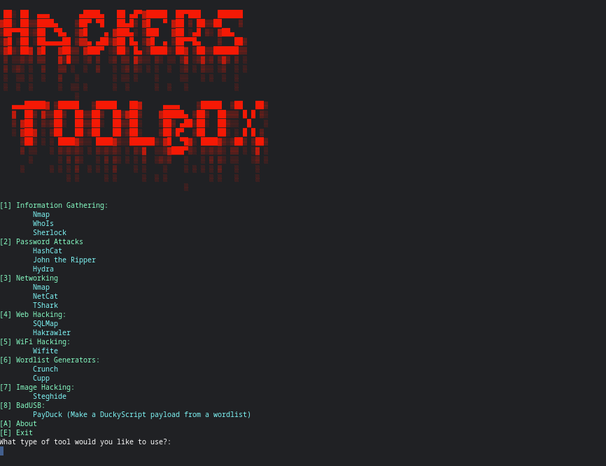

# Hackers-Toolbox
A collection of tools for ethical/white hat hackers.    
**FOR REASERCH PURPOSES ONLY.**  
**Please check how legal these tools are in your country.**  
**The creator of this does not take liability for anything this is used for**

## Thank you to everyone who made these tools.

### To use this in terminal, follow the below steps:  
1. Install this in your home directory, otherwise you will have problems running Sherlock
2. To install this in terminal, use the command ```git clone https://github.com/J0K3RS-L4UGH/Hackers-Toolbox``` 
3. To install all the required packages, use the commands ```cd Hackers-Toolbox``` ```chmod +x install.sh```, then run ```./install.sh```
4. To run, paste ```python3 HackersToolbox.py``` into the CLI
5. (Optional): edit run.cpp so the path in line 4 is the path to the ```HackersToolbox.py``` file in the cloned directory. Then run ```g++ run.cpp -o RunHackersToolbox``` and ```mv RunHackersToolbox /bin```

If you followed step 5, you should be able to use the command ```RunHackersToolbox``` and it will start.


Tools:

  Steghide

  PayDuck

  Crunch

  Cupp

  Wifite

  SQLMap

  Hakrawler

  Nmap

  WhoIs

  Sherlock

  HashCat

  John the Ripper

  Hydra

  Nmap

  WhoIs

  Sherlock


Screenshot:



This is Debian Linux distros only.
